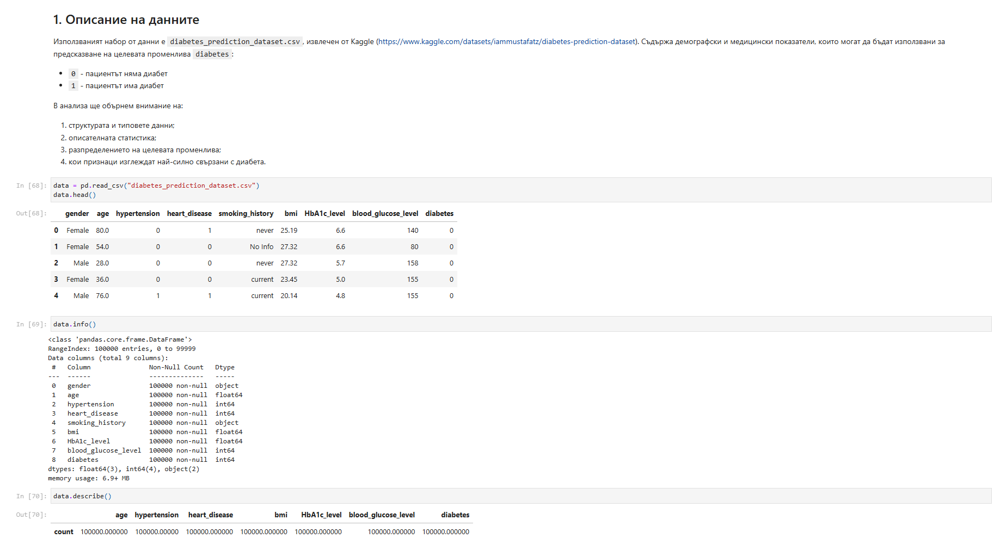
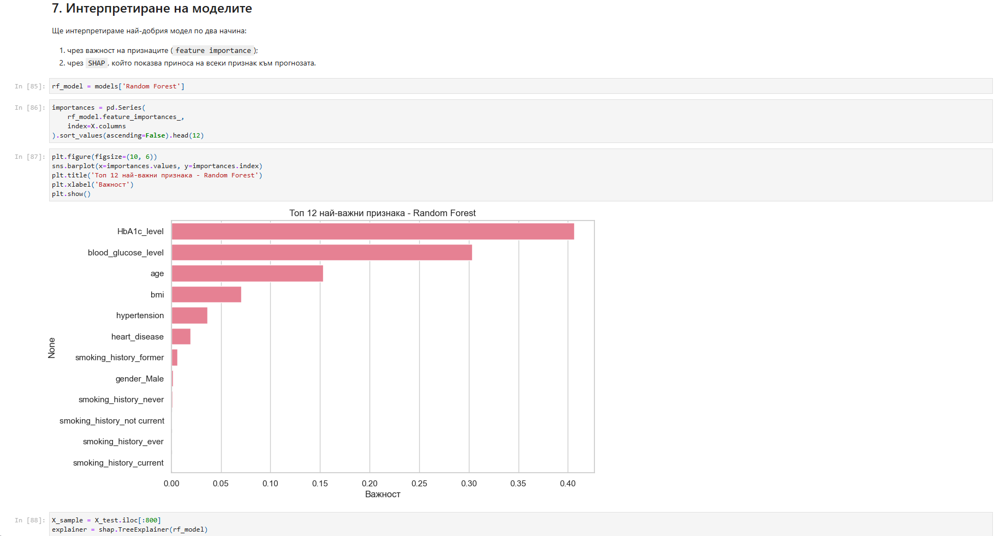

# Diabetes Prediction (Binary Classification)

**Machine Learning project** for predicting whether a patient has diabetes based on medical and demographic features.


**Review**
<div align="center">
  
  
</div>

## 📋 Table of Contents
- [Overview](#overview)
- [Dataset](#dataset)
- [Key Features](#key-features)
- [Results](#results)
- [Project Structure](#project-structure)
- [How to Run](#how-to-run)
- [Technologies](#technologies)

## Overview
This project performs **exploratory data analysis (EDA)**, trains several classification models, and provides model interpretability using **SHAP**. The best model achieved strong performance on the imbalanced dataset.

**Best Model**: Random Forest (high recall for the positive class — important for medical applications).

## Dataset
- Source: [Kaggle - Diabetes Prediction Dataset](https://www.kaggle.com/datasets/iammustafatz/diabetes-prediction-dataset)
- 100,000 records with features like `age`, `bmi`, `HbA1c_level`, `blood_glucose_level`, `hypertension`, etc.
- Target: `diabetes` (0 = No, 1 = Yes)

## Key Features
- Full EDA with visualizations
- Handling of categorical variables (One-Hot Encoding)
- Class imbalance handling (`class_weight='balanced'`)
- Multiple models: Logistic Regression, Decision Tree, Random Forest
- Model evaluation (ROC-AUC, Precision-Recall, Confusion Matrix)
- **SHAP** interpretability (global + local explanations)

## Results
- **Random Forest** achieved the best balance (see notebook for full metrics).
- Strong correlation with `HbA1c_level`, `blood_glucose_level`, `age`, and `bmi`.

*(Add screenshots here: ROC curve, SHAP summary, confusion matrix, feature importance)*

## How to Run

1. Clone the repo:
   ```bash
   git clone https://github.com/yourusername/diabetes-prediction.git
   cd diabetes-prediction
